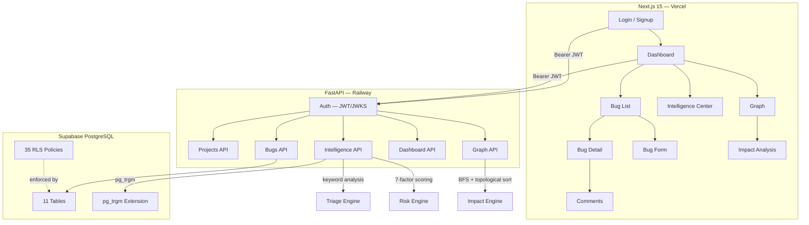
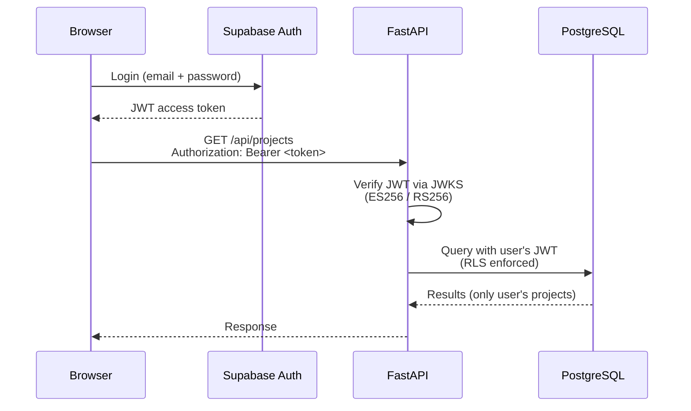
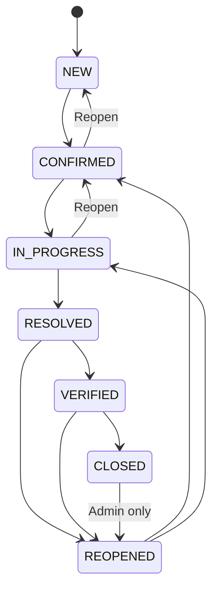
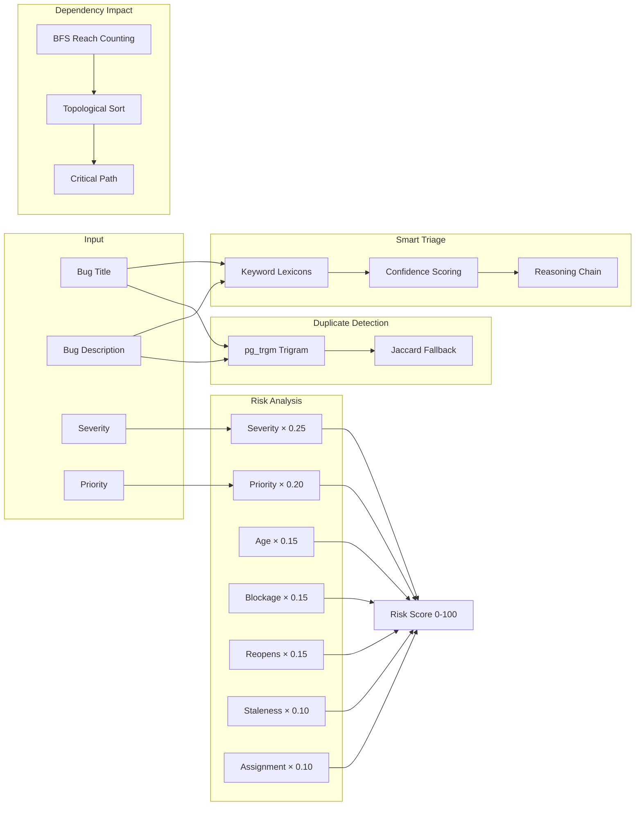
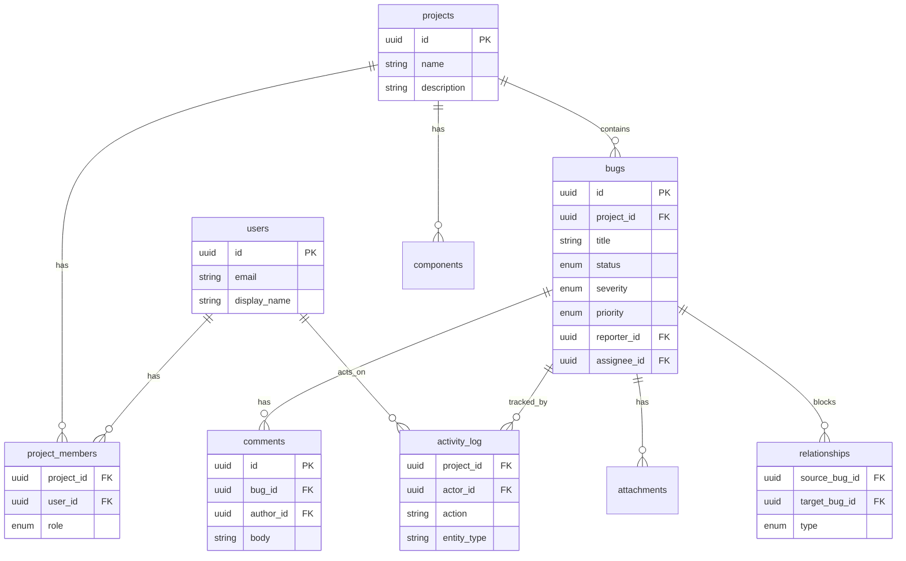

# BugNexus

> A bug tracking platform with deterministic intelligence, dependency graph impact analysis, and database-level security — built in3 days for CloneFest hackathon.

**Live Demo:** [project-2-sigma-seven.vercel.app](https://project-2-sigma-seven.vercel.app) · **API Docs:** [/docs](https://project2-production-526d.up.railway.app/docs)

---

## What It Does

BugNexus tracks software bugs from report to resolution. It adds four intelligence features that most bug trackers don't have: smart triage, duplicate detection, risk analysis, and dependency impact analysis. All run without AI — pure Python rules and PostgreSQL.

## Architecture



### Authentication Flow



### Bug Lifecycle State Machine



Every transition is validated at **three layers**: frontend (UI), backend (FastAPI), and database (RLS). You cannot skip states.

### Intelligence Engine



**Zero AI. Zero LLM. Zero external APIs.** Every result is explainable with a reasoning chain.

### Database Schema



11 tables · 35 RLS policies · pg_trgm extension for duplicate detection

---

## Tech Stack

| Layer | Technology | Purpose |
|-------|-----------|---------|
| Frontend | Next.js 15, React 19, TypeScript, Tailwind CSS | App Router, type safety, responsive UI |
| Backend | Python 3.10+, FastAPI, Pydantic v2 | Async API, validation, auto-docs |
| Database | Supabase PostgreSQL | Managed Postgres + Auth + RLS |
| Auth | Supabase Auth + ES256 JWT | JWKS verification, no custom auth |
| Intelligence | Python heuristics + pg_trgm | Zero-cost deterministic analysis |
| Deployment | Vercel (frontend) + Railway (backend) | Auto-deploy on push |

---

## Features

### Core Functionality

| Feature | Details |
|---------|---------|
| Bug Lifecycle | 7 states: NEW → CONFIRMED → IN_PROGRESS → RESOLVED → VERIFIED → CLOSED (+ REOPENED) |
| RBAC | 4 tiers: REPORTER → DEVELOPER → QA → ADMIN |
| Full CRUD | Bugs, comments, components, relationships, projects |
| Search | Global search with filter, sort, pagination |
| Audit Trail | Every mutation logged with actor, old/new values, timestamps |
| Keyboard Shortcuts | J/K navigate, Enter opens, / focuses search |

### Intelligence Features

| Feature | How It Works | Cost |
|---------|-------------|------|
| Smart Triage | Keyword analysis + confidence scoring + reasoning chain | $0 |
| Duplicate Detection | PostgreSQL pg_trgm trigram similarity + Jaccard fallback | $0 |
| Risk Analysis | 7-factor weighted scoring (severity, priority, age, blockage, reopens, staleness, assignment) | $0 |
| Dependency Impact | BFS reach counting + topological sort for critical path | $0 |

### Security

| Feature | Implementation |
|---------|---------------|
| JWT Verification | JWKS-based ES256/RS256 with auto key rotation |
| Row-Level Security | 35 policies — users can only see their projects |
| Service-Role Isolation | Admin client only for seed/demo — never for user requests |
| Security Headers | X-Content-Type-Options, X-Frame-Options, Cache-Control: no-store |
| Rate Limiting | Per-user sliding window (100/min) on intelligence endpoints |
| Input Validation | Pydantic v2 schemas on all endpoints |

---

## API Endpoints

| Method | Endpoint | Description |
|--------|----------|-------------|
| `GET` | `/health` | Health check |
| `GET` | `/health/detail` | Health with DB ping, uptime, version |
| **Projects** | | |
| `GET` | `/api/projects` | List user's projects |
| `POST` | `/api/projects` | Create project (auto-adds creator as ADMIN) |
| `PUT` | `/api/projects/{id}` | Update project (ADMIN) |
| `DELETE` | `/api/projects/{id}` | Delete project (ADMIN) |
| **Bugs** | | |
| `GET` | `/api/projects/{id}/bugs` | List bugs (filter, sort, paginate) |
| `POST` | `/api/projects/{id}/bugs` | Create bug |
| `GET` | `/api/projects/{id}/bugs/{id}` | Get bug details |
| `PUT` | `/api/projects/{id}/bugs/{id}` | Update bug |
| `PATCH` | `/api/projects/{id}/bugs/{id}/status` | Change status (lifecycle enforced) |
| `PATCH` | `/api/projects/{id}/bugs/{id}/assign` | Assign bug (DEVELOPER+) |
| `GET` | `/api/bugs/search?q=...` | Global search |
| **Comments** | | |
| `GET` | `/api/bugs/{id}/comments` | List comments |
| `POST` | `/api/bugs/{id}/comments` | Add comment |
| `PUT` | `/api/bugs/{id}/comments/{id}` | Edit comment |
| `DELETE` | `/api/bugs/{id}/comments/{id}` | Delete comment |
| **Intelligence** | | |
| `POST` | `/api/intelligence/projects/{id}/bugs/triage` | Smart triage |
| `POST` | `/api/intelligence/projects/{id}/bugs/duplicates` | Find duplicates |
| `POST` | `/api/intelligence/projects/{id}/bugs/risk` | Risk analysis |
| **Graph** | | |
| `GET` | `/api/graph` | Dependency graph + impact analysis |
| **Dashboard** | | |
| `GET` | `/api/dashboard/stats` | Dashboard statistics |
| `GET` | `/api/dashboard/recent` | Recent activity |
| `GET` | `/api/dashboard/intelligence` | Intelligence overview |
| **Demo** | | |
| `POST` | `/api/demo/setup` | One-click demo setup |

Full interactive docs at `https://project2-production-526d.up.railway.app/docs`.

---

## Project Structure

```
T2/
├── frontend/                     # Next.js 15 application
│   ├── src/
│   │   ├── app/
│   │   │   ├── (auth)/           # Login, Signup
│   │   │   └── (dashboard)/      # 12 pages (Dashboard, Bugs, Graph, Intelligence, etc.)
│   │   ├── components/layout/    # Sidebar, Header, MobileNav
│   │   ├── lib/
│   │   │   ├── api.ts            # Typed API client with caching
│   │   │   ├── supabase.ts       # Browser auth client
│   │   │   ├── types.ts          # TypeScript types matching backend
│   │   │   └── config.ts         # Environment configuration
│   │   └── hooks/                # useDebounce
│   └── package.json
│
├── backend/                      # FastAPI application
│   ├── app/
│   │   ├── auth.py               # JWT verification (ES256/RS256, JWKS)
│   │   ├── dependencies.py       # FastAPI dependency injection
│   │   ├── supabase_client.py    # Service-role + user-context clients
│   │   ├── helpers.py            # Role checking, activity logging
│   │   ├── middleware.py         # Security headers, request ID, access logging
│   │   ├── exceptions.py         # Custom error classes + handlers
│   │   ├── routers/              #10 routers (projects, bugs, comments, etc.)
│   │   └── models/               # Pydantic request/response schemas
│   ├── tests/                    #100 backend tests
│   └── requirements.txt
│
├── database/                     # SQL migrations
│   ├── schema.sql                #11 tables, indexes, enums
│   ├── rls.sql                   #35 Row-Level Security policies
│   ├── auth_trigger.sql          # Supabase Auth → users sync
│   ├── audit_function.sql        # log_activity() SECURITY DEFINER
│   ├── project_creation.sql      # Atomic project + admin creation
│   ├── find_similar_bugs.sql     # pg_trgm duplicate detection RPC
│   └── README.md                 # Full schema documentation
│
├── scripts/
│   └── seed.py                   # Database seeder
│
└── tests/                        # Integration tests
    └── e2e/
```

---

## Quick Start

### Prerequisites

- Node.js ≥ 18
- Python ≥ 3.10
- Supabase account ([free tier works](https://supabase.com))

### 1. Database Setup

1. Go to [Supabase Dashboard](https://supabase.com/dashboard) → SQL Editor
2. Run these files in order:
   ```sql
   -- 1. schema.sql
   -- 2. rls.sql
   -- 3. auth_trigger.sql
   -- 4. audit_function.sql
   -- 5. project_creation.sql
   -- 6. find_similar_bugs.sql
   ```

### 2. Backend

```bash
cd backend
python -m venv .venv
source .venv/bin/activate

cat > .env << 'EOF'
SUPABASE_URL=https://your-project.supabase.co
SUPABASE_ANON_KEY=your-anon-key
SUPABASE_SERVICE_ROLE_KEY=your-service-role-key
CORS_ORIGINS=http://localhost:3000,http://127.0.0.1:3000
EOF

pip install -r requirements.txt
uvicorn app.main:app --reload --port 8000
# → http://localhost:8000/docs
```

### 3. Frontend

```bash
cd frontend
cat > .env.local << 'EOF'
NEXT_PUBLIC_API_URL=http://localhost:8000
NEXT_PUBLIC_SUPABASE_URL=https://your-project.supabase.co
NEXT_PUBLIC_SUPABASE_ANON_KEY=your-anon-key
EOF

npm install
npm run dev
# → http://localhost:3000
```

### 4. Seed Data (Optional)

```bash
cd backend
python -m scripts.seed            # normal seed (idempotent)
python -m scripts.seed --dry-run  # preview without writing
```

---

## Testing

### Backend — 100 Tests

```bash
cd backend
pytest tests/ -v
# 100 passed in ~5s
```

| Category | Tests | What It Proves |
|----------|-------|----------------|
| Auth Module | 3 | JWT verification, ES256/RS256, JWKS caching |
| Bug Lifecycle | 9 | All 7 state transitions validated |
| Triage Algorithm | 11 | Keyword matching, confidence, input validation |
| Jaccard Similarity | 5 | Duplicate detection math |
| Risk Analysis | 4 | 7-factor weighted scoring |
| Graph Impact | 9 | BFS reach counting, cycle detection, critical path |
| Models | 7 | Pydantic validation, enum completeness |
| Exceptions | 6 | All HTTP error codes mapped |
| Frontend Types | 3 | Backend enums match frontend TypeScript |
| Endpoint Behavior | 10 | Auth enforcement on protected routes |
| Search Security | 5 | Input escaping for special characters |
| Bug Fixes | 9 | Error mapping, sort validation, triage input guards |
| Rate Limiting | 4 | 429 on budget overflow, health detail shape |
| RLS Integration | 7 | Membership required, role hierarchy, contract checks |

### Frontend

```bash
cd frontend
npx tsc --noEmit    # TypeScript: 0 errors
npx next lint       # ESLint: 0 warnings
npm run build       # Build: 15/15 pages
```

### CI Pipeline

GitHub Actions runs on every push to `main`:

```
Lint → TypeCheck → Build → Backend Tests (100 tests)
```

No `|| true` — real test failures block deployment.

---

## Deployment

### Frontend (Vercel)

Auto-deploys on push to `main`.

```
NEXT_PUBLIC_API_URL=https://project2-production-526d.up.railway.app
NEXT_PUBLIC_SUPABASE_URL=https://qirqjgenrhhrvpogqnvf.supabase.co
NEXT_PUBLIC_SUPABASE_ANON_KEY=***
```

### Backend (Railway)

Auto-deploys on push to `main`.

```
SUPABASE_URL=https://qirqjgenrhhrvpogqnvf.supabase.co
SUPABASE_ANON_KEY=***
SUPABASE_SERVICE_ROLE_KEY=***
CORS_ORIGINS=https://project-2-sigma-seven.vercel.app
```

---

## Demo Account

Click **⚡ Try Demo Account** on the login page — no signup needed.

- Email: `demo@company.com`
- Password: `Demo1234!`

Pre-seeded with73 bugs across4 projects, relationships, comments, and activity.

---

## Under the Hood

Features that work but aren't obvious from the landing page:

| Feature | What It Does |
|---------|-------------|
| **Comments** | Threaded discussion on every bug — create, edit, delete with author tracking |
| **Activity Timeline** | Every mutation logged: who did what, when, old → new value. Visible on bug detail pages |
| **Risk Factor Breakdown** | Each risk score shows exactly why: severity(16.2/25), priority(12/15), age(2.5/15), etc. |
| **Search** | Global full-text search across all projects with filter, sort, pagination |
| **Keyboard Shortcuts** | J/K navigate bugs, Enter opens, / focuses search, Esc deselects graph nodes |
| **Project Management** | Create projects, invite members, assign roles — full team workflow |
| **Component Tracking** | Categorize bugs by component, view component health in reports |
| **Relationships** | Link bugs as blocks/depends_on/related_to — drives the dependency graph |
| **User Roles** | 4-tier RBAC with real enforcement — REPORTER can't reassign, only ADMIN can manage members |

---

## What I'd Improve With More Time

| Improvement | Why |
|-------------|-----|
| Real-time updates (WebSocket) | Live collaboration across tabs |
| File attachments | Attach stack traces, screenshots |
| Email notifications | Alert on assignment, status change |
| Integration tests against live DB | Currently uses mocked data |
| Saved searches | Save filter combinations |
| Project switcher | Currently uses first project |

---

## How It Compares

| Feature | BugNexus | Typical Bug Tracker |
|---------|----------|-------------------|
| Bug lifecycle | 7 states, validated at app + DB level | Basic status field |
| Access control | 35 RLS policies + 4-tier RBAC | App-level only |
| Triage | Keyword analysis + confidence + reasoning | Manual assignment |
| Duplicate detection | pg_trgm trigram similarity | None |
| Risk scoring | 7-factor weighted formula | None |
| Dependency graph | BFS + critical path analysis | Basic links |
| Audit trail | Every mutation logged | None |
| Testing | 100 backend tests | Basic coverage |
| Security | JWT/JWKS + RLS + service-role isolation | Basic auth |

---

## Team

| Role | Responsibility |
|------|---------------|
| Dev 1 — Security | Authentication, RBAC, RLS policies, database security |
| Dev 2 — Backend | API endpoints, business logic, data models |
| Dev 3 — Frontend | UI/UX, responsive design, all pages and components |
| Dev 4 — Intelligence | Triage engine, duplicate detection, risk analysis, testing |

---

## License

MIT

---

Built with ❤️ for CloneFest hackathon
