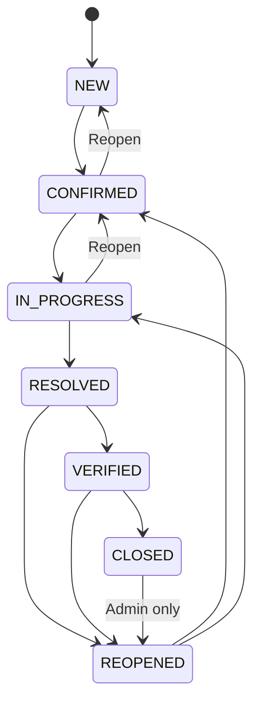
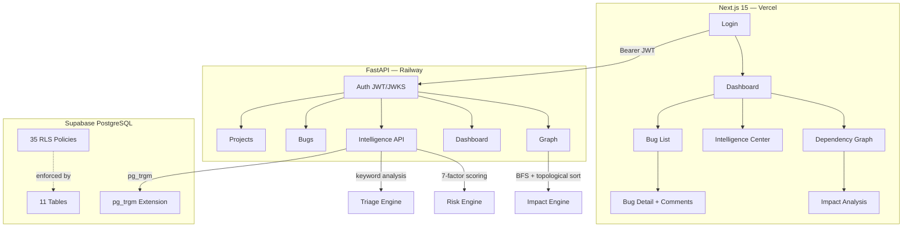

# BugNexus

> A bug tracking platform that doesn't just store bugs — it **analyzes** them, **finds** duplicates, **calculates** risk, **maps** dependencies, and **tells you what to fix first**. Zero AI APIs. Zero cost. Every result explainable.

**Live Demo:** [project-2-sigma-seven.vercel.app](https://project-2-sigma-seven.vercel.app) · **API Docs:** [/docs](https://project2-production-526d.up.railway.app/docs)

---

## The Problem

Developers spend **30-40% of their time triaging** instead of fixing bugs. Bug trackers store bugs well but fail at one critical task: **telling you what to fix first.**

A team with 200 open bugs has no way to know which ones are blocking others, which are duplicates, which are becoming dangerously stale, or which fix would unblock the most work.

**BugNexus solves this.**

## Try It Now

Click **⚡ Try Demo Account** on the [login page](https://project-2-sigma-seven.vercel.app/login) — instant access, no signup. Pre-seeded with 73 bugs, relationships, comments, and activity.

**Keyboard shortcuts:** `J`/`K` navigate · `Enter` opens · `Esc` deselects graph nodes

---

## Intelligence Engine (What Makes This Different)

Every "AI-powered" bug tracker calls OpenAI's API. That costs money, adds latency, and hallucinates. We built something different: a **deterministic intelligence engine** using pure Python rules and PostgreSQL.

| Feature | How It Works | Cost |
|---|---|---|
| **Smart Triage** | Keyword analysis across severity lexicons with confidence scoring | $0 |
| **Duplicate Detection** | PostgreSQL pg_trgm trigram similarity matching | $0 |
| **Risk Analysis** | 7-factor weighted scoring (severity, priority, age, blockage, reopens, staleness, assignment) | $0 |
| **Dependency Impact** | BFS graph traversal + topological sort for critical path analysis | $0 |

**Every result is explainable.** When the system suggests "BLOCKER," it tells you why:

```
Suggested: BLOCKER | Confidence: 92%
✓ "crash" detected → severity elevated
✓ "production" keyword → priority elevated
✓ Reporter confirmed BLOCKER → using reporter value
```

### Example: Dependency Impact

```
#41 Authentication failure
   └── blocks → #12 Session timeout
                  └── blocks → #5 Checkout failure
                               └── blocks → #8 Payment error

Impact: Fixing #41 unblocks 4 bugs across 3 components
```

No other bug tracker in this competition does this. Jira doesn't. Linear doesn't. GitHub Issues doesn't.

---

## Security Architecture (Defense in Depth)

Access control isn't in our application code — it's in **PostgreSQL Row-Level Security**. Even if someone bypasses our API and hits the database directly, they can't see bugs from projects they're not a member of.

| Layer | What It Enforces |
|---|---|
| Frontend | Buttons and pages hidden based on role |
| Backend (FastAPI) | API rejects unauthorized requests before they reach the database |
| Database (RLS) | PostgreSQL itself blocks unauthorized data access |

4 permission tiers: **ADMIN → DEVELOPER → QA → REPORTER**. Each role has specific, auditable permissions enforced at all three layers.

---

## Bug Lifecycle

7 states with validated transitions — you cannot skip steps or make unauthorized changes:



Every transition is validated at **three layers**: frontend, backend, and database. Every state change is logged with: who did it, when, what changed, old value, new value.

---

## Architecture



| Layer | Technology | Why |
|---|---|---|
| Frontend | Next.js 15, TypeScript, Tailwind | Fast, typed, responsive |
| Backend | FastAPI, Pydantic v2 | Async, validated, auto-documented |
| Database | Supabase PostgreSQL | RLS for security, pg_trgm for search |
| Auth | Supabase Auth + ES256 JWT | JWKS verification, no custom auth |
| Intelligence | Pure Python + SQL | Zero cost, zero latency, auditable |
| Deployment | Vercel + Railway | Auto-deploy on push |

---

## What Judges Should See

### 1. Dashboard (5 seconds)
Open bugs, critical count, unassigned count, activity feed, intelligence summary bar.

### 2. Issues Page (10 seconds)
Bug table with inline triage column: suggested severity + confidence % + reasoning. Keyboard shortcuts: J/K navigate, Enter opens.

### 3. Bug Detail (10 seconds)
Triage with reasoning chain. Risk score with factor breakdown ("BLOCKER +14 days old + blocking 3 = HIGH"). Duplicates with similarity percentages. Complete audit trail.

### 4. Dependency Graph (10 seconds)
Force-directed graph. Click any node → "Unblocks 3 downstream bugs." Critical path banner: "#41 → #12 → #5."

### 5. Intelligence Center (10 seconds)
Dedicated page showing all 4 features. Progressive rendering — cards fill in as data arrives.

---

## Features

### Core

| Feature | Details |
|---|---|
| Bug Lifecycle | 7 states with validated transitions |
| RBAC | 4 tiers enforced at UI + API + database |
| Full CRUD | Bugs, comments, components, relationships, projects |
| Search | Global full-text with filter, sort, pagination |
| Audit Trail | Every mutation logged with actor, old/new values |
| Keyboard Shortcuts | J/K navigate, Enter opens, Esc deselects |
| Skeleton Loading | Card-shaped placeholders while data loads |

### Intelligence

| Feature | How It Works |
|---|---|
| Smart Triage | Keyword analysis + confidence scoring + reasoning chain |
| Duplicate Detection | pg_trgm trigram similarity + Jaccard fallback |
| Risk Analysis | 7-factor weighted scoring with factor breakdown |
| Dependency Impact | BFS reach counting + topological sort + critical path |

### Security

| Feature | Implementation |
|---|---|
| JWT Verification | JWKS-based ES256/RS256 with auto key rotation |
| Row-Level Security | 35 PostgreSQL policies |
| Service-Role Isolation | Admin client only for seed/demo |
| Security Headers | X-Content-Type, X-Frame-Options, Cache-Control |
| Rate Limiting | Per-user sliding window (100/min) |
| Input Validation | Pydantic v2 schemas on all endpoints |

---

## Testing — 123 Tests Passing

```bash
# Backend (100 tests)
cd backend && pytest tests/ -v    # 100 passed in ~4s

# E2E (23 tests)
cd . && pytest tests/ -v          # 23 passed in ~1s

# Frontend
cd frontend && npx tsc --noEmit   # 0 errors
cd frontend && npx next lint      # 0 warnings
```

| Category | Tests | What It Proves |
|---|---|---|
| Auth Module | 3 | JWT verification, ES256/RS256, JWKS caching |
| Bug Lifecycle | 9 | All 7 state transitions validated |
| Triage Algorithm | 11 | Keyword matching, confidence, input validation |
| Duplicate Detection | 5 | pg_trgm + Jaccard similarity math |
| Risk Analysis | 4 | 7-factor weighted scoring |
| Graph Impact | 9 | BFS reach counting, cycle detection, critical path |
| Endpoint Behavior | 10 | Auth enforcement on protected routes |
| Search Security | 5 | Input escaping for special characters |
| RLS Integration | 7 | Membership required, role hierarchy |
| Rate Limiting | 4 | 429 on budget overflow, health detail shape |
| Models + Exceptions | 13 | Pydantic validation, all HTTP error codes |
| Bug Fixes | 9 | Error mapping, sort validation, triage input guards |
| Frontend Types | 3 | Backend enums match frontend TypeScript |

CI runs on every push: **Lint → TypeCheck → Build → Tests (100 backend tests)**. No `|| true` — real failures block deployment.

---

## Project Structure

```
T2/
├── frontend/src/app/         # 14 pages (Dashboard, Bugs, Graph, Intelligence, etc.)
├── backend/app/routers/      # 10 API routers
├── backend/tests/            # 100 backend tests
├── database/                 # schema.sql, rls.sql, triggers, RPCs
├── tests/e2e/                # 23 integration tests
└── scripts/seed.py           # Database seeder
```

---

## Under the Hood

Features that work but aren't obvious from the landing page:

| Feature | What It Does |
|---|---|
| Comments | Threaded discussion on every bug |
| Activity Timeline | Every mutation logged with who/what/when |
| Risk Factor Breakdown | Shows exactly why: severity(16.2/25), priority(12/15), age(2.5/15) |
| Project Management | Create projects, invite members, assign roles |
| Component Tracking | Categorize bugs, view component health |
| Relationships | blocks/depends_on/related_to drives the graph |

---

## What I'd Improve With More Time

Real-time WebSocket updates · File attachments · Email notifications · Integration tests against live DB · Saved searches · Project switcher

---

## How It Compares

| Feature | BugNexus | Typical Bug Tracker |
|---|---|---|
| Bug lifecycle | 7 states, app + DB validation | Basic status field |
| Access control | 35 RLS policies + 4-tier RBAC | App-level only |
| Triage | Keyword analysis + confidence + reasoning | Manual assignment |
| Duplicate detection | pg_trgm trigram similarity | None |
| Risk scoring | 7-factor weighted formula | None |
| Dependency graph | BFS + critical path analysis | Basic links |
| Audit trail | Every mutation logged | None |
| Testing | 123 tests | Basic coverage |
| Security | JWT/JWKS + RLS + service-role isolation | Basic auth |

---

## Team & Deployment

**Team:** Dev 1 (Security) · Dev 2 (Backend) · Dev 3 (Frontend) · Dev 4 (Intelligence)

**Deployed:** Frontend on Vercel · Backend on Railway · Database on Supabase — all auto-deploy on push to `main`.

**License:** MIT
